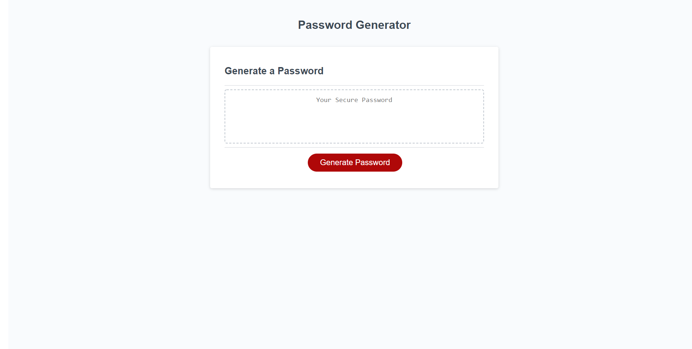

# Password Generator

# Description

This project allows you to generate a completely cryptic and secure password at random based off of a set of user prompts.

# Table of Contents

- [Description](#Description)

- [Installation](#Installation)

- [Usage Information](#Usage-Information)

- [Contribution guidelines](#Contribution-guidelines)

- [Test instructions](#Test-instructions)

- [License](#License)

# Installation

This project does not require any installation and can be used at it's deployment site

# Usage Information

Click the generate password button and respond to the pop-up prompts. After that, your password will be generated, and you can copy and paste it wherever you would like to securely store it.

# Contribution guidelines

Open to any contributions. Please don't hesitate to reach out!

# Test instructions

No testing required

# License
    
- [MIT] https://www.mit.edu/~amini/LICENSE.md

# Questions?

- GitHub: jarenella

- Email: jamesa122333@gmail.com

